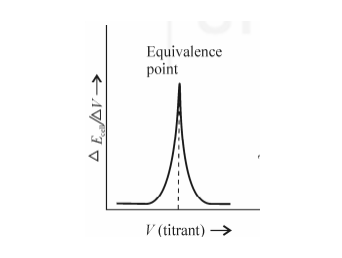

### Theory:
Potentiometric titration is a type of voltammetric analysis. It is used to determine the
concentration of an analyte (strong acid or base) in a sample and the titration is performed using
a titrant of known concentration. After performing the titration, the potential difference between
the reference and indicator electrode is measured in conditions where a thermodynamic
equilibrium is maintained and the current through the electrodes does not disturb this
equilibrium.
Potentiometric determination of endpoint depends on the potential across two electrodes
immense into a solution. The potential is measured in millivolts using electrodes. By using the
measurements of electric potential, the equivalence point can be determined. The potential of the
solution depends on the nature and the concentration of ions present. In this experiment,
quinhydrone is used, it is an equilibrium mixture of quinone and hydroquinone. A known volume
of the acid to be titrated is kept in a beaker. It consists of 25ml HCl and a pinch of quinhydrone.
Along with this, a platinum electrode and saturated calomel electrode are connected to the
potentiometer and the electrodes are dipped in the beaker. The prepared standard NaOH solution
is filled in a burette and added in a small volume to the beaker. The value displayed on the
potentiometer is noted after each addition. A graph is plotted by taking the volume of NaOH
added along the x-axis and the corresponding voltage on the y-axis.

A sudden change in potential in the graph of Δ𝐸/Δ𝑉 against the volume of the titrating solution
will reveal the equivalence point of the reaction.
Potentiometric titration involves the measurement of Ecell with the addition of titrant. The
electromotive force of the cell can be represented as:-
EMF of the cell,
Ecell = Ecal - EQuinhydrone
= 0.2422 – (0.699 – 0.0591 pH)
= 0.2422 – 0.699 + 0.0591 pH
Ecell depends on the concentration of the interested ions with which the indicator electrode is in
contact. The overall cell potential, Ecell is calculated at every interval where the titrant is
measured and added